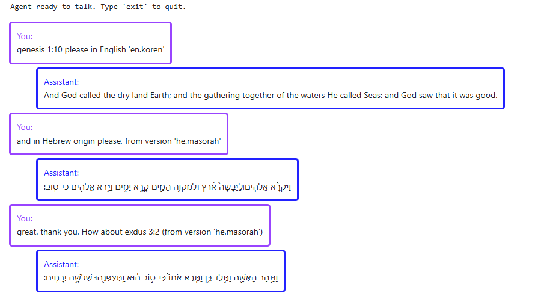

[TODO]: https://img.shields.io/badge/TODO-0044FF?style=flat
[Done]: https://img.shields.io/badge/Done-44CC44?style=flat
[WIP]: https://img.shields.io/badge/WIP-44CCCC?style=flat

# Bible Assistant
AI Assistant for analyzing biblical texts.

## Why
Learning about Biblical texts is a hobby of mine. I like listening to lectures about critical biblical research.
Sometimes, I have research questions of my own and want to do my own research and interpret the ancient text.
Here's an example scenario - when reading the story of the garden of Eden (Genesis), I wonder:
- `What's the meaning of the Hebrew word ערום (arum), said about the snake?`
- `Why is it so similar (in Hebrew) to the word ערומים (arumim), mentioned about Adam and Eve? Is it just beautiful literature, or is there a hidden meaning to it?`
- `Where else was this word ערום used and in what contexts?`
- `How did various translators choose to translate that word?`
- `What did the biblical author/editor want to teach us readers with this story?`

The bible is also a great domain for me to practice my professional skills (GenAI, LLM, NLP): it is public domain text, covers multiple genres of literature, has many translations to other languages, is very well indexed (book, chapter, verse), and has thousands of years of scholars (and 200 years of critical researchers) analyze it - so there's plenty of resources for ground truth.

I decided to implement an AI assistant to help me do my biblical research.
- This is a personal project. It is designed for low-resource usage, on a personal computer, without cloud-based LLM services.
- Besides being a hobby of mine, this is an exercise in resourcefulness when you have limited resources. :-)
- Created by Yonatan Vaizman. January 2026...

---

Prep:
- This agent assumes you have downloaded bible books from Sefaria.
  - See [sefaria_code module](../sefaria/sefaria_code.py)
  - Set an environment variable (e.g., in a hidden ".env" file) SEFARIA_DATA_DIR to indicate where you want to (locally) store bible books.
  - See examples of downloading books [example_notebook](../playground/observe_bible_text.ipynb)
  - I appreciate the wonderful work of Sefaria: (https://www.sefaria.org/texts), (https://github.com/Sefaria/Sefaria-Export)
- Environment:
  - Currently (Jan 2026), I am developing this repo using a personal PC with Windows 11 (personal project -> no macbook ;-) ).
  - I am using a virtual environment for python 3.12.0. (e.g., in Windows PowerShell `py -3.12 -m venv .venv`, and then `.\.venv\Scripts\activate` to enter the virtual environment).
  - Inside the "venv" install libraries `pip install -r requirements` (from the repo's main folder). It is possible that different environments need different library versions. I'll try to maintain specific [requirements.txt](../requirements.txt) for smooth reproducibility.
- Usage:
  - To "play" with this agent, go to the user entry point - [talk_to_agent.ipynb](talk_to_agent.ipynb).
  - Here's an example snapshot of a conversation with the agent (screenshot from the notebook):
  

## Project structure:
- [talk_to_agent.ipynb](talk_to_agent.ipynb): This is where I (the user) interact with the agent. At the moment, it's mainly to test if it's working properly. Hopefully, I'll get to really use the agent, ask sophisticated questions about the texts in the bible ;-).
- [agent.py](agent.py): The agentic AI framework. The frontend converses with the user, the backend communicates with a driving LLM (locally running) and calls tools.
- [bible_tools.py](bible_tools.py): Tools for the agent. If there's an efficient (and accurate) way to do something, I'll implement it programmatically with a tool.
- [test_the_tools.ipynb](test_the_tools.ipynb): A helper notebook to test/debug the functionality of the tools, regardless of any agent and LLM.
- [generate_finetune_examples.ipynb](generate_finetune_examples.ipynb): This is how I teach the LLM how to behave - what response-schema to use, when (and when not) to use tools, which tool, how to use the tools. In this notebook, I generate many example conversations that demonstrate this. Part of the challenge is covering a wide variety of scenarios (this may blow up once I add many tools, so I'll need to be careful and creative) while making sure the model's responses are "correct". Another challenge I'll have once I want the agent to start reasoning about the meaning of text (but I may dedicate a separate notebook for that ;-) ).
- [finetune_model.ipynb](finetune_model.ipynb): Taking a base model (e.g., gemma3-1b-it) and fine tuning it (using LoRA) with my custom generated examples. Then merging the adaptation parameters into the base model's parameters and registring the merged model with ollama (so that the agent can later use it to drive conversations).

## This application is still under development.
Things to do:
- ![Done][Done] Agent: basic agentic framework [agent.py](agent.py)
- ![Done][Done] Interacting with the agent [talk_to_agent.ipynb](talk_to_agent.ipynb)
- ![Done][Done] Tool: lookup_verse by book, version, chapter number, verse number. [bible_tools.py](bible_tools.py)
- ![Done][Done] Generating example conversations for lookup_verse (including error in version name or book name). [generate_finetune_examples.ipynb](generate_finetune_examples.ipynb)
- ![Done][Done] Fine-tune LLM. Currently supporting Gemma3 models. LoRA. Include merge adaptation into base model, and register with local ollama. [finetune_model.ipynb](finetune_model.ipynb)
- ![WIP][WIP] Tool: search / concordance (find all biblical references for a word or phrase)
- ![TODO][TODO] Automate tool registration. Perhaps use docstrings (like in ADK) to add tool description to system-prompt and register tool's input/output schema
- ![TODO][TODO] Simplify tool schema. Make it easy on LLM (e.g., lookup_verse should accept all kinds of version names and figure out the right version). Perhaps all tools should have a dict args as single argument?
- ![WIP][WIP] Train for sequence of requests. Generate examples of consecutive requests from the user.
- ![TODO][TODO] Train for autonomous sequence of tool calls to get the answer.
- ![WIP][WIP] AgentUI: display user/assistant messages as bubbles, and display intermediate events (tool calls/responses) asynch.
- ![TODO][TODO] UI: present links to supporting evidence (I need tools to return supported evidence and AgentUI to present them nicely).
- ![TODO][TODO] Tasks: create complex examples that require a bit of planning and execusion of a sequence of function calls.
- ![TODO][TODO] Interpreting texts' meaning. Perhaps train two LLMs: One LLM to learn how/when to call tools (and a bit of planning), and second LLM to look at all the gathered text evidence and infer meaning from it (and add an "agent transfer" mechanism).
- ![TODO][TODO] Create tasks that can be verified and prepare evaluation data with designed score for the agent's result.
- ![TODO][TODO] RL: let the agent handle tasks autonomously. Examine and score the results. Re-train LLM with the higher scored paths.
- ![TODO][TODO] RLHF: once I have generative tasks (e.g., explain the meaning of the word ...; how can the word ... be interpreted in different ways...?) I can generate agent responses, human-evaluate them (or with a strong LLM as a judge), and re-train the meaning-LLM with PPO / DPO. Note: I can separate this from the goodness of the planning/executing LLM(s). I can manually craft tasks, including perfectly available evidence/quotes/references/context, and focus on the goodness of the meaning-LLM's response.
- ![TODO][TODO] Midrash. Utilize generations of interpreters of biblical text as biased-ground-truth. How can I use this (without training an LLM to think like certain old scholars/rabis)?
